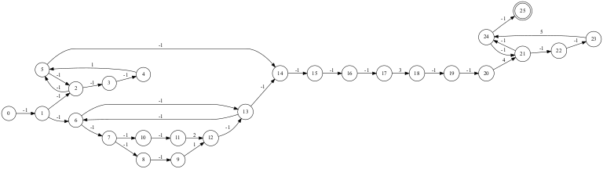
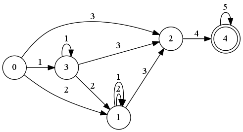
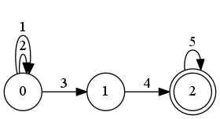

# FSA

This WIP library generates Finite State Automatons from regexes, converts NFAs to DFAs and then minimizes them. Its main usage is as a component of graph algorithms and not for string matching.

Example:

```rust
extern crate fsa;
use fsa::{DFA, NFA};


fn main()
{
    let nfa = NFA::from_regex("(a*|(a|b)*)cde*").unwrap();
    //nfa.print_graphviz();

    let mut dfa = DFA::from_nfa(&nfa);
    //dfa.print_graphviz();
    dfa.minimize();

    dfa.print_graphviz();
}
```

Install graphviz and e.g. run with:

```
$ cargo run | dot -Tpng > graph.png
```

Original NFA:



DFA:



Minimized DFA:


